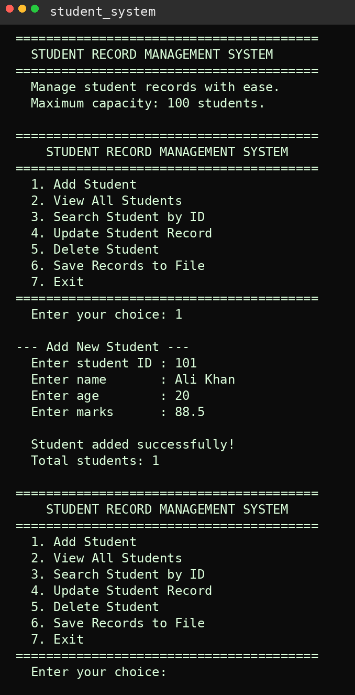
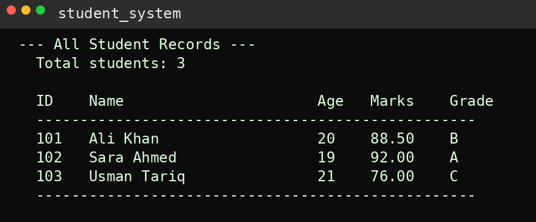

# Student Record Management System in C

A console-based student record management system built in C. The user can add, view, search, update, delete, and save student records through a clean menu system. Every record stores an ID, name, age, and marks — with a letter grade calculated automatically.

---

## Screenshots





---

## Why I Built This

My previous project — the Contact Manager — introduced me to structs, arrays, and string functions. This project pushed that further. A student record system needs more than just storing data — it needs to calculate grades, format output into a table, handle updates to existing records, and write data to a file.

The file saving feature was the biggest new thing. For the first time I wrote a program that produces a real output file you can open and read. That felt like a significant step forward.

---

## What the Program Does

- Add a student — stores ID, name, age, and marks with duplicate ID detection
- View all students — displays a formatted table with automatically calculated grades
- Search by ID — finds and displays a single student's full record
- Update a student — edit name, age, or marks of an existing record by ID
- Delete a student — removes by ID and shifts remaining records to fill the gap
- Save to file — writes all records to `students.txt` with grades included
- Exit — clean goodbye message

---

## Grade System

| Marks | Grade |
|---|---|
| 90 and above | A |
| 80 to 89 | B |
| 70 to 79 | C |
| 60 to 69 | D |
| Below 60 | F |

---

## How to Run It

**You need GCC installed. Check with:**
```bash
gcc --version
```

**Compile:**
```bash
gcc student_record_system.c -o student_system
```

**Run:**
```bash
./student_system
```

After saving records a file called `students.txt` will appear in the same folder as the program.

---

## How I Built It — 5 Commit History

**Commit 1 — Project structure, Student struct, and menu**
Created `student_record_system.c` and defined the `Student` struct with four fields — `int id`, `char name[]`, `int age`, and `float marks`. This was the first time I used `float` in a project. Set up the `students[]` array, `student_count`, and the full 7-option menu skeleton with placeholders.

**Commit 2 — Add student with duplicate ID detection**
Wrote `add_student()` and introduced `%f` and `scanf("%f")` for reading float values. Added a duplicate ID check — before saving, a loop compares the new ID against every existing record. If a match is found the function stops immediately. Two students can never share the same ID.

**Commit 3 — View all students with grade display**
Wrote `view_students()` and learned column formatting. `%-5d` and `%-25s` — the `-` means left-aligned, the number means column width. This keeps the table clean and aligned no matter how long the name is. `%.2f` prints marks with exactly 2 decimal places. The grade calculation uses a simple `if/else if` chain.

**Commit 4 — Search by ID and update student record**
Wrote `search_student()` to find a record by ID and print the full details. Added `update_student()` — the most complex function so far. It finds the student, shows the current value of each field, then lets the user type a new value or press Enter to keep the old one. Used `strcpy()` for the first time to copy a new name into the struct field — you cannot use `=` for strings in C.

**Commit 5 — Delete student and save to file**
Wrote `delete_student()` using the same shift technique from the Contact Manager. Added `save_to_file()` — the first file handling in any of my projects. `FILE *file` is a pointer to a file. `fopen()` opens or creates it. `fprintf()` writes to it exactly like `printf` but into the file. `fclose()` closes it when done. Always check if `fopen` returned NULL before using the file.

---

## What I Learned

**`float` and `%f`** — integers cut off decimals. `float` stores values like `85.5` and `92.3` correctly. `%f` in `scanf` reads them, `%.2f` in `printf` displays them with 2 decimal places always.

**Column formatting with `%-Nd`** — the `-` left-aligns and the number sets the column width. Without this a table looks messy because every name is a different length. With it every column lines up perfectly.

**`strcpy()` for string assignment** — you cannot write `students[i].name = new_name` in C. Strings need `strcpy(destination, source)` which copies character by character. This is one of those C rules that trips up beginners and I now understand why it exists.

**Duplicate ID detection** — before adding any record, loop through existing records and compare. Stop and warn if a match is found. This pattern shows up in every real data management program.

**File handling — `fopen`, `fprintf`, `fclose`** — three functions that work together. Open the file, write to it with `fprintf` the same way you use `printf`, close it. Always check if `fopen` returned NULL. Always call `fclose`. These two habits prevent file bugs and data loss.

---

## Project Structure

```
student-record-system-c/
├── student_record_system.c
├── students.txt               ← generated when you save records
├── README.md
└── screenshots/
    ├── menu.png
    └── table.png
```

---

## Tech

- **Language:** C (C99)
- **Compiler:** GCC
- **Libraries:** `stdio.h`, `stdlib.h`, `string.h` — standard library only


---

## Connect

[](https://www.linkedin.com/in/muhammad-ramzan-bb63233aa/)
[](mailto:mramzan14700@gmail.com)

---

*Sixth project in my C portfolio. First program that writes to a file. Built commit by commit as part of learning structs, float, file handling, and data management in C.*